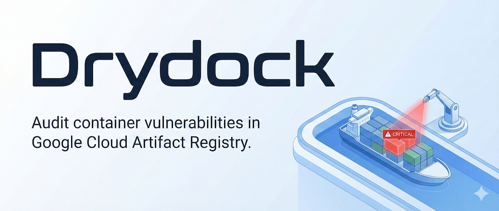

<div align="center">
  
</div>

# Drydock

**A lightweight CLI to audit container vulnerabilities in Google Cloud Artifact Registry.**

Drydock fetches vulnerability data directly from Google Cloud's Container Analysis API, allowing you to filter out noise and focus on High/Critical threats across your repositories.

## 🚀 Installation

### macOS & Linux (Recommended)

Run the following command to automatically download and install the latest binary.

**Default Installation (to `/usr/local/bin`):**

```bash
curl -sSfL https://raw.githubusercontent.com/hiro-o918/drydock/main/install.sh | sh
```

**Custom Installation Path:**
To install to a specific directory (e.g., local bin), set the `INSTALL_DIR` variable:

```bash
curl -sSfL https://raw.githubusercontent.com/hiro-o918/drydock/main/install.sh | INSTALL_DIR=$HOME/.local/bin sh
```

_(Make sure to add the target directory to your `$PATH`)_

### Go Install

If you have Go installed:

```bash
go install github.com/hiro-o918/drydock@latest
```

### Manual Download

You can also download the pre-built binary from the [Releases page](https://github.com/hiro-o918/drydock/releases).

## ⚡️ Usage

### Quick Start

Scan a location for **HIGH** and **CRITICAL** vulnerabilities.

```bash
drydock -p my-project-id -l us-central1
```

### Common Scenarios

**1. Find CRITICAL vulnerabilities only**
Focus on the most urgent threats.

```bash
drydock -p my-project-id -l us-central1 -s CRITICAL
```

**2. Find only fixable vulnerabilities**
Focus on vulnerabilities that have a fix available.

```bash
drydock -l us-central1 --fixable
```

**3. Find Medium+ severity vulnerabilities that are fixable**
Focus on actionable vulnerabilities of medium or higher severity that have fixes available.

```bash
drydock -l us-central1 -s MEDIUM --fixable
```

**4. Export report to CSV**
Generate a spreadsheet-compatible file for reporting.

```bash
drydock -p my-project-id -l us-central1 -o csv > report.csv
```

**3. Inference Project ID from Environment**
If you don't specify a project ID, Drydock will attempt to infer it from your environment (e.g., environment variables, service account credentials, or GCE metadata server).

```bash
drydock -l us-central1
```

### Options

| Flag                    | Description                                                     | Default                 |
| :---------------------- | :-------------------------------------------------------------- | :---------------------- |
| `-l`, `--location`      | **(Required)** Artifact Registry location (e.g., `us-central1`) | -                       |
| `-p`, `--project`       | Google Cloud Project ID                                         | Active `gcloud` project |
| `-s`, `--min-severity`  | Filter by severity: `LOW`, `MEDIUM`, `HIGH`, `CRITICAL`         | `HIGH`                  |
| `-f`, `--fixable`       | Only show vulnerabilities that have a fix available             | `false`                 |
| `-o`, `--output-format` | Output format: `json`, `csv`, `tsv`                             | `json`                  |
| `-c`, `--concurrency`   | Number of concurrent API requests                               | `5`                     |
| `-d`, `--debug`         | Enable verbose logging                                          | `false`                 |

## 🔑 Prerequisites

Ensure you have the following configured before running:

1.  **Authentication:** Run `gcloud auth application-default login` or set `GOOGLE_APPLICATION_CREDENTIALS`.
2.  **Permissions:** Your account needs:
    - `roles/artifactregistry.reader` (To list images)
    - `roles/containeranalysis.occurrences.viewer` (To read vulnerability data)

## 🛠 Using Drydock as a Library

Drydock can be used as a library in your Go applications, allowing you to implement custom exporters or integrate vulnerability scanning into your own tools.

### Basic Usage

```go
import "github.com/hiro-o918/drydock"

func main() {
    ctx := context.Background()

    // Initialize scanner with location and options
    scanner, err := drydock.NewScanner(
        ctx,
        "us-central1",
        drydock.WithProjectID("my-project-id"),
    )
    if err != nil {
        // Handle error
    }
    defer scanner.Close()

    // Run scan with HIGH severity threshold and only fixable vulnerabilities
    if err := scanner.Scan(ctx, schemas.SeverityHigh, true); err != nil {
        // Handle error
    }
}
```

### Custom Exporters

You can implement custom exporters by implementing the `Exporter` interface:

```go
type Exporter interface {
    Export(ctx context.Context, results []schemas.AnalyzeResult) error
}
```

Example of using a custom exporter:

```go
// Create your custom exporter
customExporter := NewMyCustomExporter()

// Use it with the scanner
scanner, err := drydock.NewScanner(ctx, "us-central1",
    drydock.WithExporter(customExporter))
```

For a complete working example of a Markdown exporter, see the [markdown_exporter example](./examples/markdown_exporter).
